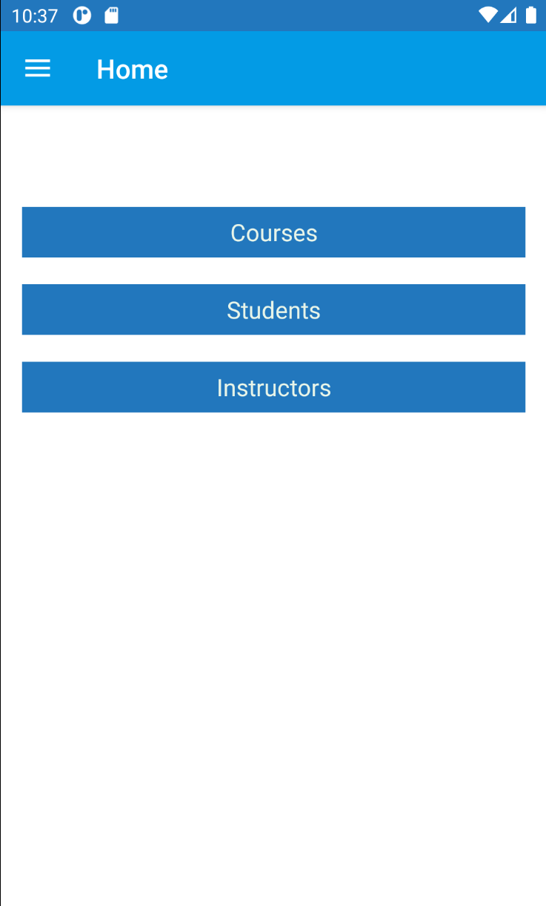

# learning-app
An Android learning application, which supports registration, communication, and task scheduling, that communicates directly with an AWS EC2 instance through a REST APIs endpoint. This application was developed as a project for my Cloud and Mobile Computing Pragmatics course. Running the application will have issues as the EC2 and RDS instances hosting the IIS providing the .NET application hosting the API code is currently suspended to reduce costs at my expense.

[Demo video](https://youtu.be/YFPar6fbaAc)

